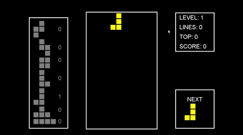

# Tetris

This is an implementation of Tetris based on [RyiSnow - How to Code Tetris in Java](https://www.youtube.com/watch?v=N1ktYfszqnM). After following the video I decided to develop some features for the game.

## Progress

- [x] Game over menu
- [x] Game over animation screen
- [ ] Set highscore
- [ ] 2 players: 2 screens on same time
- [ ] Vs Computer: 2-screen, pc on the left with ai, player on the right
 
